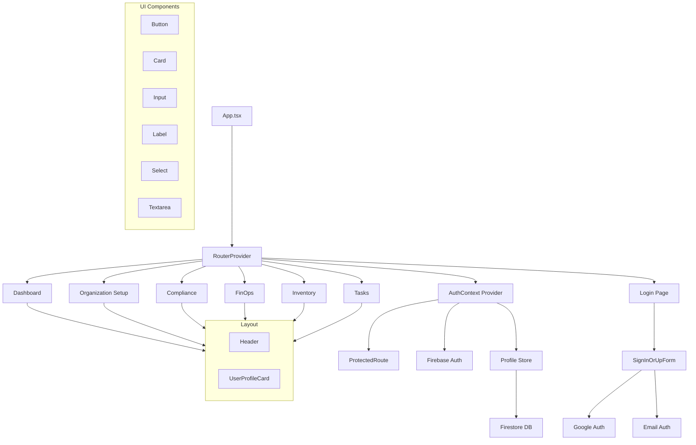

# SofClo Component Diagram

This document provides a visual representation of the component architecture in the SofClo application.

## Application Structure

## Component Descriptions

### Core Components
- **App.tsx**: Main application component that sets up routing and global providers
- **AuthContext**: Manages authentication state and user sessions
- **ProtectedRoute**: HOC that ensures routes are only accessible to authenticated users

### Authentication
- **SignInOrUpForm**: Handles both Google and email authentication
- **Firebase Auth**: Integration with Firebase Authentication service

### State Management
- **Profile Store**: Zustand store managing user profile and organization data
- **Firestore**: Cloud database storing user and organization data

### Pages
- **Login**: User authentication page
- **Dashboard**: Main application dashboard
- **Organization Setup**: New organization creation flow
- **Compliance**: Compliance management
- **FinOps**: Financial operations
- **Inventory**: Inventory management
- **Tasks**: Task management

### UI Components
- **Button**: Reusable button component
- **Card**: Container component for content
- **Input**: Form input component
- **Label**: Form label component
- **Select**: Dropdown select component
- **Textarea**: Multiline text input component

### Layout
- **Header**: Application header with navigation
- **UserProfileCard**: Displays user information and actions

## Data Flow

1. User authentication flow:
   - User signs in via Login page
   - AuthContext updates with user state
   - ProfileStore checks for organization
   - User is redirected to appropriate page

2. Protected route flow:
   - ProtectedRoute checks AuthContext
   - If authenticated, renders requested page
   - If not authenticated, redirects to login

3. Organization setup flow:
   - New user is redirected to Organization Setup
   - Form data is saved to Firestore
   - ProfileStore is updated with organization data
   - User is redirected to Dashboard

4. Dashboard and feature pages:
   - Protected by ProtectedRoute
   - Access data through ProfileStore
   - Use shared Layout components
   - Implement specific feature functionality

## Technology Stack

- React with TypeScript
- Firebase (Auth & Firestore)
- Zustand for state management
- React Router for navigation
- Tailwind CSS for styling
- Shadcn UI components
